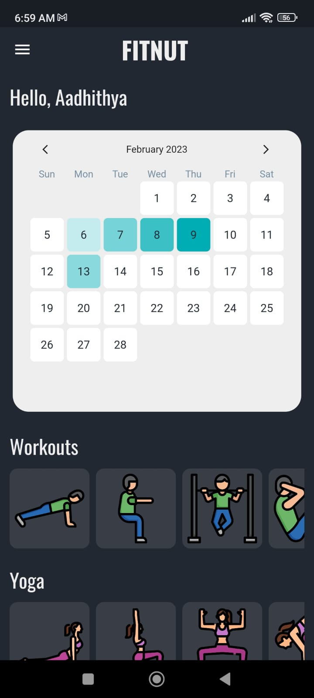
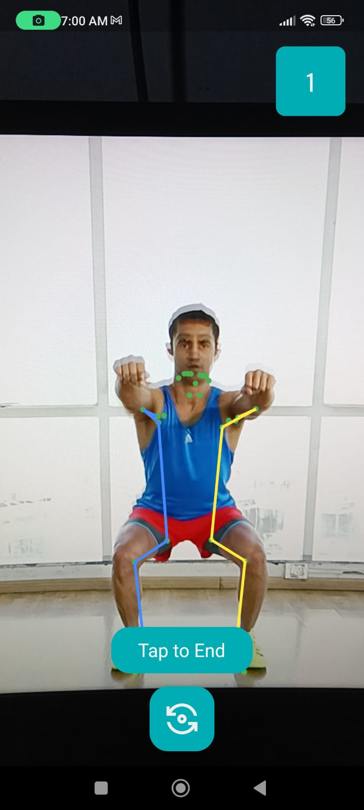

# FitNut

This project is a fitness application that uses Flutter, a mobile application development framework, and Google's MLKit to accurately detect and count reps during workouts, assign a score based on performance, and update a leaderboard for users to compete with friends and stay motivated.

  
  

## Requirements

- Flutter SDK
- Android Studio or Visual Studio Code with Flutter Extension
- Android or iOS device with camera support
- Google Cloud Console account for using MLKit APIs

## Installation

- Clone or download the repository.
- Set up your Google Cloud Console account and create a new project.
- Enable the MLKit APIs in your Google Cloud Console project.
- Obtain the MLKit API key.
- Set up the Flutter development environment on your machine.
- Connect your Android or iOS device to your machine.
- Open the project in Android Studio or Visual Studio Code.
- Add the MLKit API key to the project.
- Run the application on your device.
- This project is a starting point for a Flutter application.

## Features
- Accurately detects and counts reps during workouts using Google's MLKit pose detection.
- Assigns a score based on performance.
- Updates a leaderboard for users to compete with friends and stay motivated.
- A few resources to get you started if this is your first Flutter project:

## Contributors
This project was created by [Aadhithya D](https://github.com/Aadhithya-D), [Adithya S](https://github.com/Adithya-Sakaray), [Thiruvikraman A](https://github.com/Thiruvikraman07), [Sanjaii Vijayakumar](https://github.com/sanjaiiv04). If you would like to contribute to this project, feel free to fork the repository and submit a pull request.
